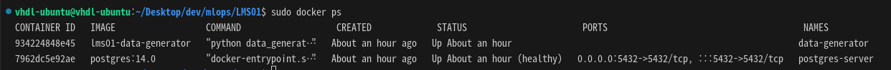
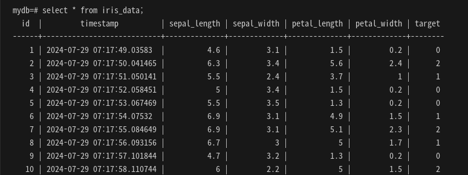

## MLOps for MLE-파트 1

### 결과물
```
LMS01
├── Dockerfile
├── data_generator.py
└── docker-compose.yaml
```

### 파일 설명

**data_generator.py**
- iris dataset을 postgres DB에 저장하기 위한 코드
- 주의사항
    - user, password, host, port, database
    - docker-compose.yaml의 environment의 변수와 동일하게 설정해야 함
    ```python
    db_connect = psycopg2.connect(
            user="user",
            password="1234",
            host=args.db_host,
            port=5432,
            database="mydb",
        )
    ```
    ```yaml
    environment:
      POSTGRES_USER: user
      POSTGRES_PASSWORD: 1234
      POSTGRES_DB: mydb
    ```

**Dockerfile**
- data_generator.py를 실행하기 위한 container 생성
- python:3.9-slim 환경(이미지)
- PostgresSQL 접속을 위한 패키지 설치
    - apt install -y postgresql-client
- data_generator.py를 실행하기 위한 라이브러리 설치
    - scikit-learn
    - pandas
    - psycopg2-binary

**docker-compose.yaml**
- Postgres DB 환경 구축
    - port -> 5432:5432 설정
    - environment -> user, password, db
        - 해당 변수는 data_generator.py의 psycopg2.connect() 변수와 동일하게 설정
    - healthcheck
        - 서비스가 원활하게 동작하는지 테스트
        - 해당 서비스의 경우, DB 실행까지 걸리는 시간이 존재
        - healthcheck를 통한 DB 정상 동작을 테스트
    ```yaml
    postgres-server:
        image: postgres:14.0
        container_name: postgres-server
        ports:
            - 5432:5432
        environment:
            POSTGRES_USER: user
            POSTGRES_PASSWORD: 1234
            POSTGRES_DB: mydb
        healthcheck:
            test: ["CMD", "pg_isready", "-q", "-U", "user", "-d", "mydb"]
            interval: 10s
            timeout: 5s
            retries: 5
    ```
- data-generator 환경 구축
    - Dockerfile을 통해 build
    - postgres-server 서비스가 선 수행되어야 함 -> depend_on 설정
        - healthcheck를 마치고 수행되어야 함 -> condition: service_healthy
    ```yaml
    data-generator:
        build:
            context: .
            dockerfile: Dockerfile
        container_name: data-generator
        depends_on:
            postgres-server:
                condition: service_healthy
        command: ["postgres-server"]
        ```

### 실행 결과
- data-generator, postgres-server 컨테이너 생성
    - 현재 동작 중인 컨테이너 환경 리스트 출력
    ```
    sudo docker ps
    ```
    - 결과물  
    
    
- DB 내용 확인
    - postgres-server 컨테이너 환경 접속
        ```
        sudo docker exec -it postgres-server /bin/bash
        ```
    - postgres db 접속
        > PGPASSWORD, -U, -d의 값은 docker-compose.yaml에서 설정한 environment의 값을 따라야함.
        ```
        PGPASSWORD=1234 psql -h postgres-server -p 5432 -U user -d mydb
        ```
    - 결과물  
    
