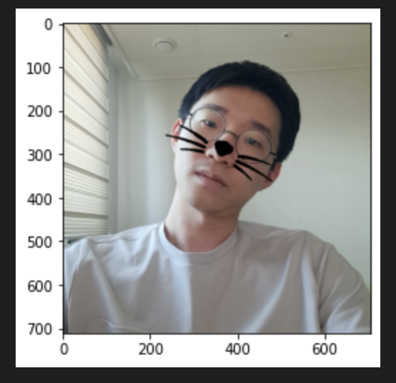

🔑 **PRT(Peer Review Template)**

- [x]  **1. 주어진 문제를 해결하는 완성된 코드가 제출되었나요? (완성도)**
    - 문제에서 요구하는 최종 결과물이 첨부되었는지 확인
        
    - 문제를 해결하는 완성된 코드란 프로젝트 루브릭 3개 중 2개, 
        - 구현 완료되었습니다.
            ```python
            # [custom start]
            # 랜드마크 27번을 이용하여 각도 계산
            import math
            x_27, y_27 = list_landmarks[0][27]
            ...
            plt.imshow(img_sticker_rotated)
            plt.show()
            # [custom end]
            ```
    퀘스트 문제 요구조건 등을 지칭
        - 해당 조건을 만족하는 부분의 코드 및 결과물을 캡쳐하여 사진으로 첨부

- [x]  **2. 프로젝트에서 핵심적인 부분에 대한 설명이 주석(닥스트링) 및 마크다운 형태로 잘 기록되어있나요? (설명)**
    - [x] 가독성이 좋은 간결한 주석으로 기록되어있습니다.
        ```python
        # 스티커가 들어갈 범위에 스티커 사진을 넣을지 원본 이미지를 넣을지 설정
        img_show_rgb[refined_y:refined_y+img_sticker.shape[0], refined_x:refined_x+img_sticker.shape[1]] = \
            np.where(img_sticker==0, img_sticker, sticker_area).astype(np.uint8)
        plt.imshow(img_show_rgb)
        plt.show()
        ```
    - [x] 실행 시간도 같이 기록하고 각 옵션에 대한 기록도 되어있습니다.
        ```
        실행시간
        - n=1) 0.246
        - n=2) 1.042
        - n=3) 3.934
        - n=4) 16.458

        검출 영역
        - n=1~4까지 모두 다름
        - 하지만 3~4로 갈수록 얼굴외곽에 딱 맞는 detection을 보여주는 듯 함
        ```

- [ ]  **3. 프로젝트에 대한 회고가 상세히 기록 되어 있나요? (회고, 정리)**
    - [x]  배운 점
    - [ ]  아쉬운 점
    - [x]  느낀 점
    - [ ]  어려웠던 점