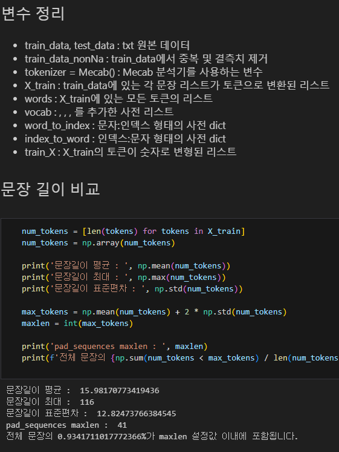

🔑 **PRT(Peer Review Template)**

- [YES]  **1. 주어진 문제를 해결하는 완성된 코드가 제출되었나요? (완성도)**
    - 문제에서 요구하는 최종 결과물이 첨부되었는지 확인
    - 문제를 해결하는 완성된 코드란 프로젝트 루브릭 3개 중 2개, 
    퀘스트 문제 요구조건 등을 지칭
        - 해당 조건을 만족하는 부분의 코드 및 결과물을 캡쳐하여 사진으로 첨부

리뷰어 : 최종 결과물이 첨부되었음. 

- [YES]  **2. 프로젝트에서 핵심적인 부분에 대한 설명이 주석(닥스트링) 및 마크다운 형태로 잘 기록되어있나요? (설명)**
    - [대상아님]  모델 선정 이유
    - [대상아님]  Metrics 선정 이유
    - [대상아님]  Loss 선정 이유

리뷰어 : 진행이 깔끔하고 이해하기 쉽게 되어 있음

- [YES]  **3. 체크리스트에 해당하는 항목들을 모두 수행하였나요? (문제 해결)**
    - [YES]  데이터를 분할하여 프로젝트를 진행했나요? (train, validation, test 데이터로 구분)
    - [대상아님]  하이퍼파라미터를 변경해가며 여러 시도를 했나요? (learning rate, dropout rate, unit, batch size, epoch 등)
    - [YES]  각 실험을 시각화하여 비교하였나요?
    - [YES]  모든 실험 결과가 기록되었나요?

리뷰어 : 3개의 모델에 관해 모든 실험 결과가 기록되고, 시각화 되었음. 데이터셋도 잘 나누었음 

- []  **4. 프로젝트에 대한 회고가 상세히 기록 되어 있나요? (회고, 정리)**
    - [ ]  배운 점
    - [ ]  아쉬운 점
    - [ ]  느낀 점
    - [ ]  어려웠던 점
 
---

**추가 학습 내용**  
1. Gensim을 이용한 similar_by_word 비교
   - pretrained된 모델이 보다 유사한 단어를 잘 찾음  
    
2. pretrained된 word2vector를 이용하여 lstm 모델에 학습
   - lstm 모델은 다음과 같이 적용 (LSTM(100), Dropout(0.3), Dense(10))
   

3. custom word2vector로 학습한 모델과의 비교
    - 기존 lstm 모델
        - accuracy : 0.8435, loss : 0.4729
    -  pretrained를 사용한 lstm 모델
        - accuracy : 0.8579, loss : 0.3619
    - 정확도가 약 1.4% 상승함
        - word2vector에서 체감한 유사 단어 찾기 성능에 비해 잘 안오른 느낌이 있음
   

