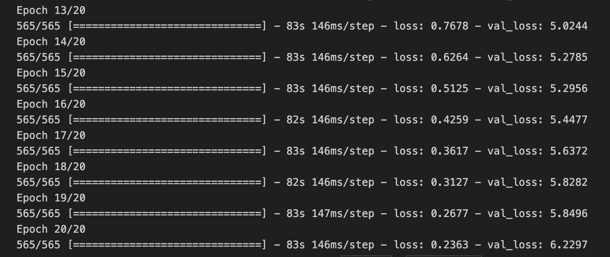

🔑 **PRT(Peer Review Template)**

reviewer: 권영찬
coder: 이현동

- [x]  **1. 주어진 문제를 해결하는 완성된 코드가 제출되었나요? (완성도)**
    - 문제에서 요구하는 최종 결과물이 첨부되었는지 확인
    - 문제를 해결하는 완성된 코드란 프로젝트 루브릭 3개 중 2개, 퀘스트 문제 요구조건 등을 지칭
        - 해당 조건을 만족하는 부분의 코드 및 결과물을 캡쳐하여 사진으로 첨부
    1. Text recognition을 위해 특화된 데이터셋 구성이 체계적으로 진행되었다.
        
    2. CRNN 기반의 recognition 모델의 학습이 정상적으로 진행되었다.
        
    3. keras-ocr detector와 CRNN recognizer를 엮어 원본 이미지 입력으로부터 text가 출력되는 OCR이 End-to-End로 구성되었다.
          
        

- [ ]  **2. 프로젝트에서 핵심적인 부분에 대한 설명이 주석(닥스트링) 및 마크다운 형태로 잘 기록되어있나요? (설명)**
    - [ ]  모델 선정 이유
    - [ ]  Metrics 선정 이유
    - [ ]  Loss 선정 이유

- [ ]  **3. 체크리스트에 해당하는 항목들을 모두 수행하였나요? (문제 해결)**
    - [x]  데이터를 분할하여 프로젝트를 진행했나요? (train, validation, test 데이터로 구분)
        
    - [ ]  하이퍼파라미터를 변경해가며 여러 시도를 했나요? (learning rate, dropout rate, unit, batch size, epoch 등)
    - [x]  각 실험을 시각화하여 비교하였나요?
        
    - [x]  모든 실험 결과가 기록되었나요?
        

- [ ]  **4. 프로젝트에 대한 회고가 상세히 기록 되어 있나요? (회고, 정리)**
    - [x]  배운 점: OCR에 대해 학습했다.
    - [x]  아쉬운 점: OCR에 대해 학습했지만 결과가 부족한만큼 실험을 더 해봐야 겠다.
    - [x]  느낀 점: 실험 결과 부분 다시 해봐야 한다.
    - [ ]  어려웠던 점