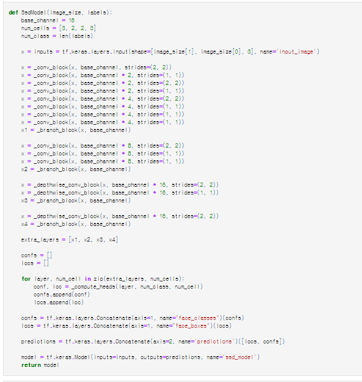

🔑 **PRT(Peer Review Template)**
리뷰어: 신재현

- [X]  **1. 주어진 문제를 해결하는 완성된 코드가 제출되었나요? (완성도)**
    - 문제에서 요구하는 최종 결과물이 첨부되었는지 확인
    - 문제를 해결하는 완성된 코드란 프로젝트 루브릭 3개 중 2개, 퀘스트 문제 요구조건 등을 지칭
        - 해당 조건을 만족하는 부분의 코드 및 결과물을 캡쳐하여 사진으로 첨부

- [X]  **2. 프로젝트에서 핵심적인 부분에 대한 설명이 주석(닥스트링) 및 마크다운 형태로 잘 기록되어있나요? (설명)**
    - [ ]  모델 선정 이유
    - [ ]  Metrics 선정 이유
    - [ ]  Loss 선정 이유
    모델, metrics, loss는 노드에서 사전에 지정되어 있기에 해당사항 없습니다.

- [X]  **3. 체크리스트에 해당하는 항목들을 모두 수행하였나요? (문제 해결)**
    - [X]  데이터를 분할하여 프로젝트를 진행했나요? (train, validation, test 데이터로 구분)
    - [X]  하이퍼파라미터를 변경해가며 여러 시도를 했나요? (learning rate, dropout rate, unit, batch size, epoch 등)
    - [X]  각 실험을 시각화하여 비교하였나요?
    - [X]  모든 실험 결과가 기록되었나요?

[img](img/tfrec.png)

tfrecord function을 사용하여 데이터셋을 형식에 맞게 처리

[img](img/multi.png)

20 에폭으로 진행한 테스트
생각보다 적은 에폭에도 결과물이 좋지 않게 나와 왜 그런지에 대한 분석을 history에 저장해 시각화했으면 좋을 것 같다.

- [ ]  **4. 프로젝트에 대한 회고가 상세히 기록 되어 있나요? (회고, 정리)**
    - [ ]  배운 점
    - [ ]  아쉬운 점
    - [ ]  느낀 점
    - [ ]  어려웠던 점

    따로 없습니다.